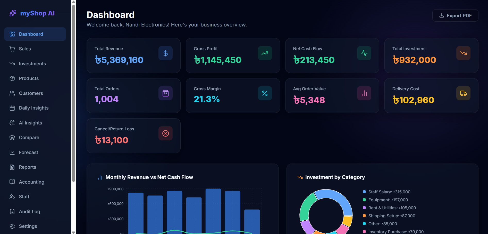

# myShop AI
> **Sales Management Powered by Google AI (Gemma 4)**



## 1. Problem Statement
Small and medium business owners in emerging markets often rely on scattered spreadsheets or pen-and-paper to manage daily sales. This manual process makes it difficult to track profitability, identify at-risk customers, or gain actionable business insights without hiring technical experts. 

## 2. Importance of the Problem
Without proper analytics, businesses lose money due to hidden inefficiencies. They fail to identify which products are actually driving profit, when customers stop buying, or if their daily margins are shrinking. A solution to this problem democratizes data intelligence, empowering millions of small business owners to grow sustainably.

## 3. Proposed Solution
**myShop AI** bridges this gap by transforming a standard spreadsheet workflow into an enterprise-level AI analytics platform. It provides an intuitive, easy-to-use dashboard that automates reporting and gives actionable advice.

**Key Features:**
- **Sales Dashboard**: See your Revenue, Profit, Total Orders, and Profit Margin at a glance.
- **Manage Orders**: Add, edit, delete, and search sales orders just like you would in Excel.
- **Role-Based Access**: Create accounts for Owners, Admins, and Staff with different permissions.
- **AI Business Insights**: Generate on-demand, bilingual (Bengali & English) executive summaries analyzing sales trends, at-risk customers, and overarching business health, powered entirely by Gemma 4.
- **Automated Daily Emails**: Every day at your configured time, the system automatically sends a summary email with AI insights.
- **Dynamic Pricing AI**: Intelligent pricing recommendations powered by Gemma 4, analyzing sales velocity and stock buffers to maximize margin and clear dead stock.
- **AI Restock Planner**: A hybrid approach using deterministic Python math to calculate exact purchase quantities and stockout dates, combined with Gemma 4 to generate a strategic, bilingual executive summary of the weekly purchase plan.
- **Google Sheets Sync**: (Optional) Connect a Google Sheet to push or pull orders directly to the web app, plus many more hidden features to streamline your business!

### 🌟 Feature Gallery

**Secure Authentication & Onboarding**


**AI Business Insights & Daily Reports**


**Dynamic Pricing AI**


**AI Restock Planner**


**Comprehensive Financials**


**Automated AI Daily Email Reports**


## 4. Gemma 4 Integration
This project uses the official Google AI APIs (via the `google-genai` SDK) to communicate exclusively with **Gemma 4**. 

- **How it works**: The backend securely holds the `GOOGLE_AI_STUDIO_KEY`. When generating a report, checking pricing, or planning restocks, the backend summarizes structured sales data (Revenue, Orders, Velocity, Days-of-Stock-Left) and prompts Gemma 4 to analyze the business's health.
- **Primary AI Features**: Gemma 4 is the sole intelligence engine behind the "Insights" page, the automated daily email reports, the **Dynamic Pricing Optimizer**, and the **AI Restock Planner**.

## 5. System Architecture
The project is divided into two main parts: a **Frontend** (React) and a **Backend** (Python).

### Folder Architecture
```text
myShop-AI/
├── backend/                  # FastAPI Backend
│   ├── routers/              # API Route definitions
│   ├── main.py               # Main application entry point
│   ├── models.py             # SQLAlchemy database models
│   ├── ai_service.py         # Google AI Studio / Gemma integration
│   ├── email_service.py      # Automated daily Email generation
│   ├── sheets_service.py     # Google Sheets sync logic
│   ├── database.py           # Database connection & setup
│   ├── auth.py               # JWT authentication logic
│   └── requirements.txt      # Python dependencies
├── frontend/                 # React Frontend (Vite)
│   ├── src/                  
│   │   ├── components/       # Reusable UI components (Sidebar, FormattedText, etc)
│   │   ├── pages/            # Page components (Dashboard, Accounting, Products, etc)
│   │   ├── services/         # API client & backend communication
│   │   ├── contexts/         # React Context (Auth State)
│   │   └── utils/            # Helper functions (PDF Export, etc)
│   └── package.json          # Node dependencies
└── README.md                 # Project documentation
```

## 6. Technical Implementation
- **Frontend**: Built with React and Vite for fast performance. Uses `Recharts` for displaying beautiful Revenue and Profit charts, and natively renders rich Markdown (bolding, etc.) for all Gemma 4 summaries.
- **Backend**: Built with **FastAPI**, a modern and fast Python web framework.
- **Database**: Uses `SQLite` by default (easy to run locally) through `SQLAlchemy` ORM. 
- **Authentication**: Uses secure JWT (JSON Web Tokens) to manage user logins and roles.
- **Background Tasks**: Uses `APScheduler` to run a background job every hour for generating and sending AI reports via SMTP.

## 7. Challenges Encountered
- **Prompt Engineering for Bengali**: Ensuring Gemma 4 generated high-quality, professional business advice in Bengali required careful prompt tuning, as direct translations often sounded unnatural.
- **Data Formatting for AI**: Feeding raw tabular data into the LLM resulted in hallucinations. We overcame this by pre-calculating KPIs (Revenue, AOV, Profit) in Python and passing a structured summary to the model. We also ensured accuracy by strictly handling cancelled and returned orders in the Python layer before sending net figures to Gemma.

## 8. Expected Impact
By making AI-driven analytics accessible and affordable, myShop AI can help thousands of small shop owners optimize their inventory, retain customers, and increase their daily profit margins. 

## 9. Future Improvements
- **Voice-First Order Entry**: Let shop owners speak an order in Bengali and have Gemma 4 extract a structured sale, so even non-typists can log sales at the counter.
- **Two-Way Google Sheets Sync**: Implement real-time, bidirectional synchronization between the web app and Google Sheets using Apps Script webhooks.
- **Mobile Application**: Build a dedicated mobile app for store staff to input sales directly from their phones.
---

## 💻 Repository Requirements

### 1. Dependencies
- **Backend**: Python 3.11+. All backend dependencies (FastAPI, SQLAlchemy, APScheduler, etc.) are listed in `backend/requirements.txt`.
- **Frontend**: Node.js 20+. All frontend dependencies (React, Vite, Recharts, etc.) are listed in `frontend/package.json`.

### 2. Configuration Files
The project relies on environment variables. You can copy the provided `.env.example` file in the `backend` folder to `.env` and fill in your keys:
```env
# Required for Gemma 4 AI features
GOOGLE_AI_STUDIO_KEY="AIzaSy..."

# Optional: To enable Automated Daily AI Emails via Google Apps Script
APPSCRIPT_WEBHOOK_URL="https://script.google.com/macros/s/.../exec"
```

#### How to Generate the APPSCRIPT_WEBHOOK_URL
To set up free email sending via Google Apps Script:
1. Go to [Google Apps Script](https://script.google.com/) and click **New Project**.
2. Replace the default code with the following:
   ```javascript
   function doPost(e) {
     try {
       // Parse the incoming JSON request
       const postData = JSON.parse(e.postData.contents);
       
       // Extract parameters
       const toEmail = postData.to;
       const subject = postData.subject;
       const body = postData.body;
       const isHtml = postData.is_html;
       
       if (!toEmail || !subject || !body) {
         return ContentService.createTextOutput(JSON.stringify({
           status: "error",
           message: "Missing 'to', 'subject', or 'body' in request."
         })).setMimeType(ContentService.MimeType.JSON);
       }
       
       // Send the email
       if (isHtml) {
         MailApp.sendEmail({
           to: toEmail,
           subject: subject,
           htmlBody: body
         });
       } else {
         MailApp.sendEmail(toEmail, subject, body);
       }
       
       // Return success response
       return ContentService.createTextOutput(JSON.stringify({
         status: "success",
         message: "Email sent successfully to " + toEmail
       })).setMimeType(ContentService.MimeType.JSON);
       
     } catch (error) {
       // Return error response
       return ContentService.createTextOutput(JSON.stringify({
         status: "error",
         message: error.toString()
       })).setMimeType(ContentService.MimeType.JSON);
     }
   }
   ```
3. Click **Deploy** > **New deployment**.
4. Choose type: **Web app**.
5. Set "Execute as" to **Me** and "Who has access" to **Anyone**.
6. Deploy, authorize the permissions, and copy the **Web app URL**.
7. Paste this URL into your `.env` file as `APPSCRIPT_WEBHOOK_URL`.

### 3. Installation Instructions

**Step A: Clone the Repository**
First, download the code and navigate into the newly created project folder:
```powershell
git clone https://github.com/Sushmoy-Nandi/myShop-AI-Gemma-4-Powered-Sales-Management.git
cd myShop-AI-Gemma-4-Powered-Sales-Management
```

**Step B: Backend Setup**
Open a terminal in the main project folder and run:
```powershell
cd backend
python -m venv venv
venv\Scripts\pip.exe install -r requirements.txt
venv\Scripts\uvicorn.exe main:app --reload --port 8000
```

**Step C: Frontend Setup**
Open a new terminal in the main project folder and run:
```powershell
cd frontend
npm install
npm run dev
```

### 4. Usage Guide
1. **Getting Started**: Open `http://localhost:5173` in your browser and click **Register** to create your Owner account.
2. **Hydrate with Data**: Instantly populate your database to test the AI features by uploading the 3 sample CSV files provided in the `demo_data/` folder:
   - **Products**: Navigate to the **Products** page, click the **Bulk Upload** tab, and upload `demo_data/products.csv`.
   - **Investments**: Navigate to the **Investments** page, click the **Bulk Upload** tab, and upload `demo_data/investments.csv`.
   - **Sales**: Navigate to the **Sales** page, click the **Bulk Upload** tab, and upload `demo_data/sales.csv`. (The AI will instantly analyze your imported sales data!)
3. **Explore the Dashboard**: Head to the **Dashboard** to watch your Revenue and Profit charts update in real-time based on your sales.
4. **Generate AI Insights**: Go to the **Insights** page and click "Generate Full Report" to receive a comprehensive, bilingual analysis of your business health from Gemma 4.
5. **Optimize with Dynamic Pricing**: On the **Products** page, hit the **"Pricing AI"** button. Gemma 4 will analyze your sales velocity and stock buffers to suggest markup opportunities or clearance discounts.
6. **Plan AI Restocks**: Also on the **Products** page, click **"Restock AI"**. Gemma 4 cross-references your 30-day sales velocity and current inventory to generate a precise 14-day purchase plan (what to buy, what to skip).
7. **Automate Daily Reports**: Finally, go to **Settings** and schedule an automated daily AI email so you wake up to fresh insights every morning!

### 5. Troubleshooting
If you encounter any errors while setting up the project locally (such as `uvicorn` not recognized, `vite` not recognized, or npm missing native bindings), please check out our comprehensive **[Troubleshooting Guide (Google Docs)](https://docs.google.com/document/d/1bhvD6wSLvgTUWDY0tF1paNiXw-c0ipBpfczD2uuQVSM/edit?usp=sharing)**.
